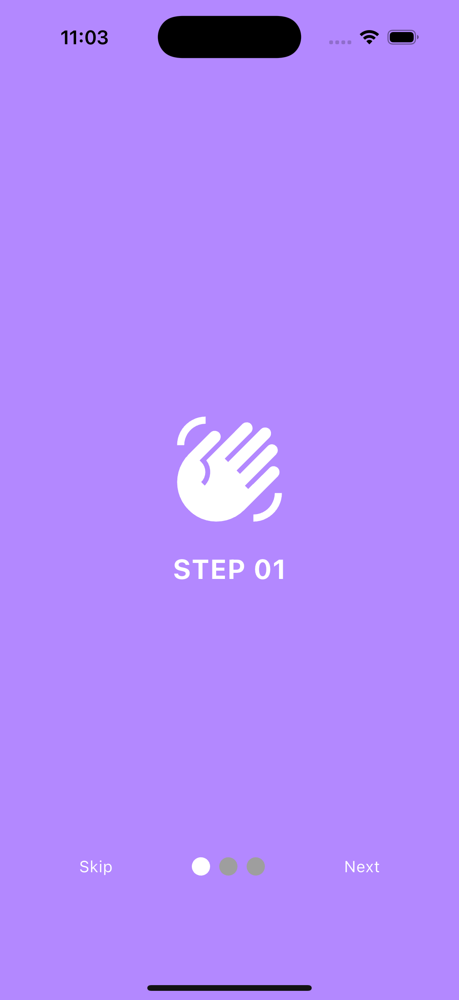
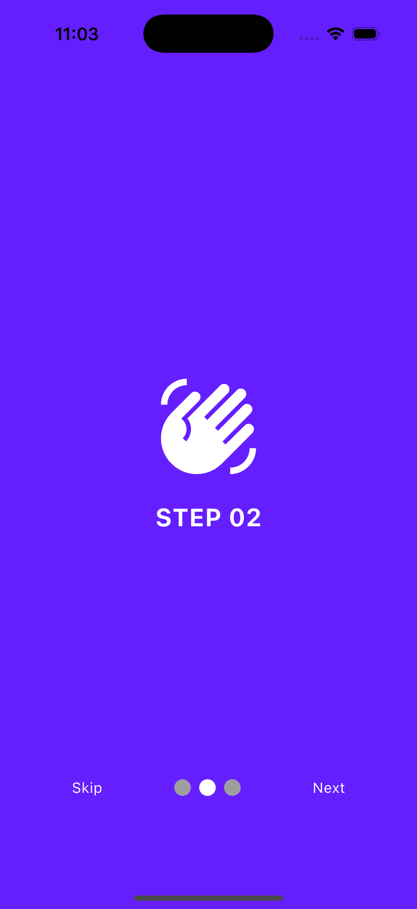
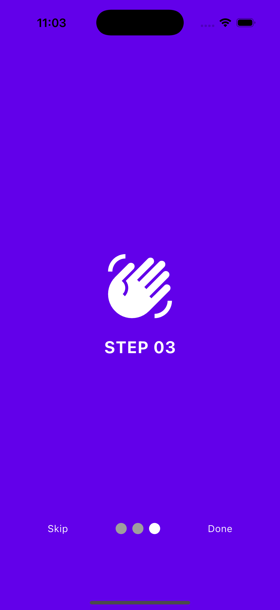
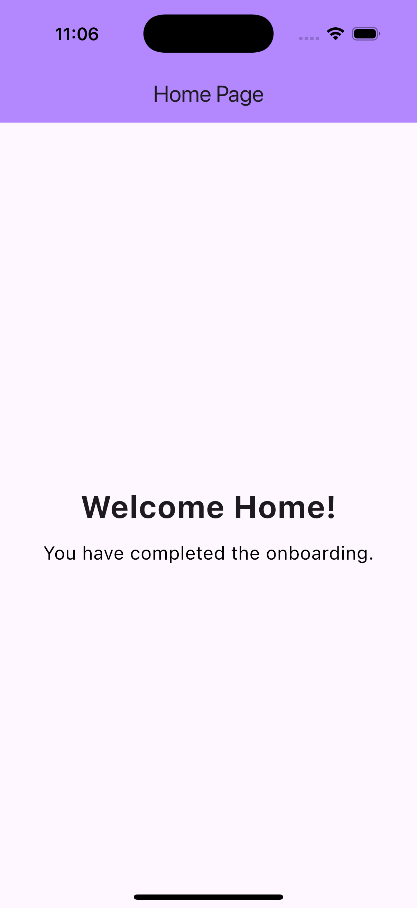

# Onboarding Screens (Flutter)

A smooth, swipeable introduction tutorial that welcomes new users to the app. This project covers the essential pattern seen in almost every major application: The **Onboarding Flow**.

  
  
  
  

## 🎯 Learning Outcomes
By building this project, you will learn:
- **PageView:** The core widget for creating full-screen swipeable areas.
- **PageController:** Managing the state of the scroll (e.g., programming a "Skip" button to jump to the end).
- **External Packages:** integrating `smooth_page_indicator` for professional-grade visual feedback.
- **Conditional UI:** Changing the bottom button from "Next" to "Done" dynamically when the user reaches the final page.

## 📱 Features
- **3 Intro Slides:** Full-screen pages with swipe gestures.
- **Animated Dots:** A "worm" style indicator that tracks the user's swipe position.
- **Navigation Logic:**
  - **Next:** smooth scrolls to the next page.
  - **Skip:** Jumps immediately to the last page.
  - **Done:** Navigates to the Home Screen (and removes the intro from memory).

## 🚀 How to Run

1. **Ensure you are in the project directory:**
    
    `cd onboarding_screens`
    
2. **Install Dependencies:**
    
    `flutter pub get`
    
3. **Run the App:**
    
    `flutter run`

## 🔙 Back to Main Repo

Find more projects and the full learning roadmap here:
[Flutter Example Apps](https://github.com/thaisangdang/flutter_example_apps)

## 📘 Want to Build Bigger Apps?

This project is just the beginning. If you want to learn how to architect production-ready applications with scalable code, check out my premium guide:

👉 [**Master Flutter Architecture - Build a Production-Ready Social App from Scratch**](https://thaisang.gumroad.com/l/flutter-architecture-build-a-social-app)

## ☕ Support My Work

If you found this project helpful, consider [buying me a coffee](https://buymeacoffee.com/thaisangdang) to keep my work coming!